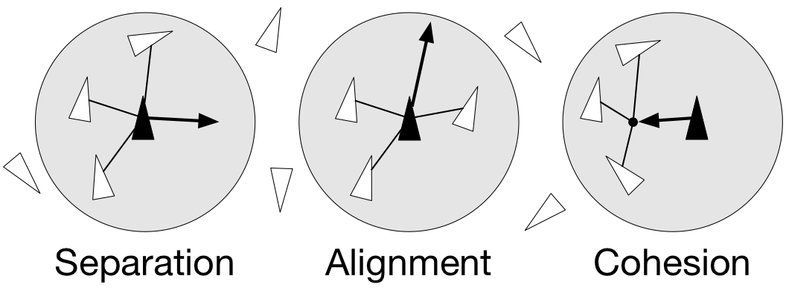

Code vectorization
===============================================================================

.. contents:: **Contents**
   :local:

Introduction
------------

Code vectorization means that the problem you're trying to solve is inherently
vectorizable and only requires a few NumPy tricks to make it faster. Of course
it does not mean it is easy or straightforward, but at least it does not
necessitate totally rethinking your problem (as it will be the case in the
`Problem vectorization`_ chapter). Still, it may require some experience to see
where code can be vectorized. Let's illustrate this through a simple example
where we want to sum up two lists of integers. One simple way using pure Python
is:

.. code-block:: python

   def add_python(Z1,Z2):
       return [z1+z2 for (z1,z2) in zip(Z1,Z2)]

This first naive solution can be vectorized very easily using NumPy:

.. code-block:: python

    def add_numpy(Z1,Z2):
        return np.add(Z1,Z2)

Without any surprise, benchmarking the two approaches shows the second method
is the fastest with one order of magnitude.

.. code-block:: python

   >>> Z1 = random.sample(range(1000), 100)
   >>> Z2 = random.sample(range(1000), 100)
   >>> timeit("add_python(Z1, Z2)", globals())
   1000 loops, best of 3: 68 usec per loop
   >>> timeit("add_numpy(Z1, Z2)", globals())
   10000 loops, best of 3: 1.14 usec per loop

Not only is the second approach faster, but it also naturally adapts to the
shape of `Z1` and `Z2`. This is the reason why we did not write `Z1 + Z2`
because it would not work if `Z1` and `Z2` were both lists. In the first Python
method, the inner `+` is interpreted differently depending on the nature of the
two objects such that if we consider two nested lists, we get the following
outputs:

.. code-block:: pycon

   >>> Z1 = [[1, 2], [3, 4]]
   >>> Z2 = [[5, 6], [7, 8]]
   >>> Z1 + Z2
   [[1, 2], [3, 4], [5, 6], [7, 8]]
   >>> add_python(Z1, Z2)
   [[1, 2, 5, 6], [3, 4, 7, 8]]
   >>> add_numpy(Z1, Z2)
   [[ 6  8]
    [10 12]]

The first method concatenates the two lists together, the second method
concatenates the internal lists together and the last one computes what is
(numerically) expected. As an exercise, you can rewrite the Python version
such that it accepts nested lists of any depth.

Uniform vectorization
---------------------

Uniform vectorization is the simplest form of vectorization where all the
elements share the same computation at every time step with no specific
processing for any element. One stereotypical case is the Game of Life that has
been invented by John Conway (see below) and is one of the earliest examples of
cellular automata. Those cellular automata can be conveniently regarded as
an array of cells that are connected together with the notion of neighbours and
their vectorization is straightforward. Let me first define the game and we'll
see how to vectorize it.

.. admonition:: **Figure 4.1**
   :class: legend

   Conus textile snail exhibits a cellular automaton pattern on its shell.
   Image by `Richard Ling <https://commons.wikimedia.org/wiki/File:Textile_cone.JPG>`_, 2005.

.. image:: data/Textile-Cone-cropped.jpg
   :width: 100%
   :class: bordered

The Game of Life
++++++++++++++++

.. note::

   Excerpt from the Wikipedia entry on the
   `Game of Life <https://en.wikipedia.org/wiki/Conway%27s_Game_of_Life>`_

The Game of Life is a cellular automaton devised by the British mathematician
John Horton Conway in 1970. It is the best-known example of a cellular
automaton. The "game" is actually a zero-player game, meaning that its
evolution is determined by its initial state, needing no input from human
players. One interacts with the Game of Life by creating an initial
configuration and observing how it evolves.

The universe of the Game of Life is an infinite two-dimensional orthogonal grid
of square cells, each of which is in one of two possible states, live or
dead. Every cell interacts with its eight neighbours, which are the cells that
are directly horizontally, vertically, or diagonally adjacent. At each step in
time, the following transitions occur:

1. Any live cell with fewer than two live neighbours dies, as if by 
   underpopulation.
2. Any live cell with more than three live neighbours dies, as if by
   overcrowding.
3. Any live cell with two or three live neighbours lives, unchanged, to the
   next generation.
4. Any dead cell with exactly three live neighbours becomes a live cell.

The initial pattern constitutes the 'seed' of the system. The first generation
is created by applying the above rules simultaneously to every cell in the seed
– births and deaths happen simultaneously, and the discrete moment at which
this happens is sometimes called a tick. (In other words, each generation is a
pure function of the one before.) The rules continue to be applied repeatedly
to create further generations.

Python implementation
+++++++++++++++++++++

.. note::

   We could have used the more efficient python `array interface
   <http://docs.python.org/3/library/array.html>`_ but it is more convenient to
   use the familiar list object.

In pure Python, we can code the Game of Life using a list of lists representing
the board where cells are supposed to evolve. Such a board will be equipped with
border of 0 that allows to accelerate things a bit by avoiding having specific
tests for borders when counting the number of neighbours.

.. code:: python

   Z = [[0,0,0,0,0,0],
        [0,0,0,1,0,0],
        [0,1,0,1,0,0],
        [0,0,1,1,0,0],
        [0,0,0,0,0,0],
        [0,0,0,0,0,0]]

Taking the border into account, counting neighbours then is straightforward:

.. code:: python

   def compute_neighbours(Z):
       shape = len(Z), len(Z[0])
       N  = [[0,]*(shape[1]) for i in range(shape[0])]
       for x in range(1,shape[0]-1):
           for y in range(1,shape[1]-1):
               N[x][y] = Z[x-1][y-1]+Z[x][y-1]+Z[x+1][y-1] \
                       + Z[x-1][y]            +Z[x+1][y]   \
                       + Z[x-1][y+1]+Z[x][y+1]+Z[x+1][y+1]
       return N

To iterate one step in time, we then simply count the number of neighbours for
each internal cell and we update the whole board according to the four
aforementioned rules:

.. code:: python

   def iterate(Z):
       N = compute_neighbours(Z)
       for x in range(1,shape[0]-1):
           for y in range(1,shape[1]-1):
                if Z[x][y] == 1 and (N[x][y] < 2 or N[x][y] > 3):
                    Z[x][y] = 0
                elif Z[x][y] == 0 and N[x][y] == 3:
                    Z[x][y] = 1
       return Z

The figure below shows four iterations on a 4x4 area where the initial state is a
`glider <https://en.wikipedia.org/wiki/Glider_(Conway%27s_Life)>`_, a structure
discovered by Richard K. Guy in 1970.

.. admonition:: **Figure 4.2**
   :class: legend

   The glider pattern is known to replicate itself one step diagonally in 4
   iterations.

.. image:: data/glider.png
   :width: 100%

NumPy implementation
++++++++++++++++++++

Starting from the Python version, the vectorization of the Game of Life
requires two parts, one responsible for counting the neighbours and one
responsible for enforcing the rules. Neighbour-counting is relatively easy if
we remember we took care of adding a null border around the arena. By
considering partial views of the arena we can actually access neighbours quite
intuitively as illustrated below for the one-dimensional case:

.. code::
   :class: output

                  ┏━━━┳━━━┳━━━┓───┬───┐
           Z[:-2] ┃ 0 ┃ 1 ┃ 1 ┃ 1 │ 0 │ (left neighbours)
                  ┗━━━┻━━━┻━━━┛───┴───┘
                        ↓︎
              ┌───┏━━━┳━━━┳━━━┓───┐
      Z[1:-1] │ 0 ┃ 1 ┃ 1 ┃ 1 ┃ 0 │ (actual cells)
              └───┗━━━┻━━━┻━━━┛───┘
                        ↑
          ┌───┬───┏━━━┳━━━┳━━━┓
   Z[+2:] │ 0 │ 1 ┃ 1 ┃ 1 ┃ 0 ┃ (right neighbours)
          └───┴───┗━━━┻━━━┻━━━┛

Going to the two dimensional case requires just a bit of arithmetic to make
sure to consider all the eight neighbours.

.. code:: python

   N = np.zeros(Z.shape, dtype=int)
   N[1:-1,1:-1] += (Z[ :-2, :-2] + Z[ :-2,1:-1] + Z[ :-2,2:] +
                    Z[1:-1, :-2]                + Z[1:-1,2:] +
                    Z[2:  , :-2] + Z[2:  ,1:-1] + Z[2:  ,2:])

For the rule enforcement, we can write a first version using NumPy's
`argwhere
<http://docs.scipy.org/doc/numpy/reference/generated/numpy.argwhere.html>`_
method that will give us the indices where a given condition is True.

.. code:: python

   # Flatten arrays
   N_ = N.ravel()
   Z_ = Z.ravel()

   # Apply rules
   R1 = np.argwhere( (Z_==1) & (N_ < 2) )
   R2 = np.argwhere( (Z_==1) & (N_ > 3) )
   R3 = np.argwhere( (Z_==1) & ((N_==2) | (N_==3)) )
   R4 = np.argwhere( (Z_==0) & (N_==3) )

   # Set new values
   Z_[R1] = 0
   Z_[R2] = 0
   Z_[R3] = Z_[R3]
   Z_[R4] = 1

   # Make sure borders stay null
   Z[0,:] = Z[-1,:] = Z[:,0] = Z[:,-1] = 0

Even if this first version does not use nested loops, it is far from optimal
because of the use of the four `argwhere` calls that may be quite slow. We can
instead factorize the rules into cells that will survive (stay at 1) and cells
that will give birth. For doing this, we can take advantage of NumPy boolean
capability and write quite naturally:

.. note::

   We did not write `Z = 0` as this would simply assign the value 0 to `Z` that
   would then become a simple scalar.

.. code:: python

   birth = (N==3)[1:-1,1:-1] & (Z[1:-1,1:-1]==0)
   survive = ((N==2) | (N==3))[1:-1,1:-1] & (Z[1:-1,1:-1]==1)
   Z[...] = 0
   Z[1:-1,1:-1][birth | survive] = 1

If you look at the `birth` and `survive` lines, you'll see that these two
variables are arrays that can be used to set `Z` values to 1 after having
cleared it.

.. admonition:: **Figure 4.3**
   :class: legend

   The Game of Life. Gray levels indicate how much a cell has been active in
   the past.

.. raw:: html

   <video width="100%" class="bordered" controls>
   <source src="data/game-of-life.mp4" type="video/mp4">
   Your browser does not support the video tag. </video>

Exercise
++++++++

Reaction and diffusion of chemical species can produce a variety of
patterns, reminiscent of those often seen in nature. The Gray-Scott
equations model such a reaction. For more information on this chemical
system see the article *Complex Patterns in a Simple System*
(John E. Pearson, Science, Volume 261, 1993). Let's consider two
chemical species :math:`U` and :math:`V` with respective
concentrations :math:`u` and :math:`v` and diffusion rates :math:`Du`
and :math:`Dv`. :math:`V` is converted into :math:`P` with a rate of
conversion :math:`k`. :math:`f` represents the rate of the process
that feeds :math:`U` and drains :math:`U`, :math:`V` and
:math:`P`. This can be written as:

.. list-table::
   :widths: 50 50
   :header-rows: 1

   * - Chemical reaction
     - Equations

   * - :math:`U + 2V  \rightarrow 3V`
     - :math:`\dot{u} = Du \nabla^2 u - uv^2 + f(1-u)`

   * - :math:`V  \rightarrow P`
     - :math:`\dot{v} = Dv \nabla^2 v + uv^2 - (f+k)v`

Based on the Game of Life example, try to implement such reaction-diffusion system.
Here is a set of interesting parameters to test:

============= ===== ===== ===== =====
Name          Du    Dv    f     k
============= ===== ===== ===== =====
Bacteria 1    0.16  0.08  0.035 0.065
------------- ----- ----- ----- -----
Bacteria 2    0.14  0.06  0.035 0.065
------------- ----- ----- ----- -----
Coral         0.16  0.08  0.060 0.062
------------- ----- ----- ----- -----
Fingerprint   0.19  0.05  0.060 0.062
------------- ----- ----- ----- -----
Spirals       0.10  0.10  0.018 0.050
------------- ----- ----- ----- -----
Spirals Dense 0.12  0.08  0.020 0.050
------------- ----- ----- ----- -----
Spirals Fast  0.10  0.16  0.020 0.050
------------- ----- ----- ----- -----
Unstable      0.16  0.08  0.020 0.055
------------- ----- ----- ----- -----
Worms 1       0.16  0.08  0.050 0.065
------------- ----- ----- ----- -----
Worms 2       0.16  0.08  0.054 0.063
------------- ----- ----- ----- -----
Zebrafish     0.16  0.08  0.035 0.060
============= ===== ===== ===== =====

The figure below shows some animations of the model for a specific set of parameters.

.. admonition:: **Figure 4.4**
   :class: legend

   Reaction-diffusion Gray-Scott model. From left to right, *Bacteria 1*, *Coral* and
   *Spiral Dense*.

.. raw:: html

   <video width="33%" controls>
   <source src="data/gray-scott-1.mp4" type="video/mp4">
   Your browser does not support the video tag. </video>

   <video width="33%" controls>
   <source src="data/gray-scott-2.mp4" type="video/mp4">
   Your browser does not support the video tag. </video>

   <video width="33%" controls>
   <source src="data/gray-scott-3.mp4" type="video/mp4">
   Your browser does not support the video tag. </video>

Sources
+++++++

* `game_of_life_python.py <code/game_of_life_python.py>`_
* `game_of_life_numpy.py <code/game_of_life_numpy.py>`_
* `gray_scott.py <code/gray_scott.py>`_ (solution to the exercise)

References
++++++++++

* `John Conway new solitaire game "life" <https://web.archive.org/web/20090603015231/http://ddi.cs.uni-potsdam.de/HyFISCH/Produzieren/lis_projekt/proj_gamelife/ConwayScientificAmerican.htm>`_, Martin Gardner, Scientific American 223, 1970.
* `Gray Scott Model of Reaction Diffusion <http://groups.csail.mit.edu/mac/projects/amorphous/GrayScott/>`_, Abelson, Adams, Coore, Hanson, Nagpal, Sussman, 1997.
* `Reaction-Diffusion by the Gray-Scott Model <http://mrob.com/pub/comp/xmorphia/>`_,
  Robert P. Munafo, 1996.

Temporal vectorization
----------------------

The Mandelbrot set is the set of complex numbers :math:`c` for which
the function :math:`f_c(z) = z^2+ c` does not diverge when iterated
from :math:`z=0`, i.e., for which the sequence :math:`f_c(0),
f_c(f_c(0))`, etc., remains bounded in absolute value. It is very easy
to compute, but it can take a very long time because you need to
ensure a given number does not diverge. This is generally done by
iterating the computation up to a maximum number of iterations, after
which, if the number is still within some bounds, it is considered
non-divergent. Of course, the more iterations you do, the more
precision you get.

.. admonition:: **Figure 4.5**
   :class: legend

   Romanesco broccoli, showing self-similar form approximating a natural fractal.
   Image by `Jon Sullivan <https://commons.wikimedia.org/wiki/File:Fractal_Broccoli.jpg>`_, 2004.

.. image:: data/Fractal-Broccoli-cropped.jpg
   :width: 100%
   :class: bordered

Python implementation
+++++++++++++++++++++

A pure python implementation is written as:

.. code-block:: python

   def mandelbrot_python(xmin, xmax, ymin, ymax, xn, yn, maxiter, horizon=2.0):
       def mandelbrot(z, maxiter):
           c = z
           for n in range(maxiter):
               if abs(z) > horizon:
                   return n
               z = z*z + c
           return maxiter
       r1 = [xmin+i*(xmax-xmin)/xn for i in range(xn)]
       r2 = [ymin+i*(ymax-ymin)/yn for i in range(yn)]
       return [mandelbrot(complex(r, i),maxiter) for r in r1 for i in r2]

The interesting (and slow) part of this code is the `mandelbrot` function that
actually computes the sequence :math:`f_c(f_c(f_c ...)))`. The vectorization of
such code is not totally straightforward because the internal `return` implies a
differential processing of the element. Once it has diverged, we don't need to
iterate any more and we can safely return the iteration count at
divergence. The problem is to then do the same in NumPy. But how?

NumPy implementation
++++++++++++++++++++

The trick is to search at each iteration values that have not yet
diverged and update relevant information for these values and only
these values. Because we start from :math:`Z = 0`, we know that each
value will be updated at least once (when they're equal to :math:`0`,
they have not yet diverged) and will stop being updated as soon as
they've diverged. To do that, we'll use NumPy fancy indexing with the
`less(x1,x2)` function that return the truth value of `(x1 < x2)`
element-wise.

.. code-block:: python

   def mandelbrot_numpy(xmin, xmax, ymin, ymax, xn, yn, maxiter, horizon=2.0):
       X = np.linspace(xmin, xmax, xn, dtype=np.float32)
       Y = np.linspace(ymin, ymax, yn, dtype=np.float32)
       C = X + Y[:,None]*1j
       N = np.zeros(C.shape, dtype=int)
       Z = np.zeros(C.shape, np.complex64)
       for n in range(maxiter):
           I = np.less(abs(Z), horizon)
           N[I] = n
           Z[I] = Z[I]**2 + C[I]
       N[N == maxiter-1] = 0
       return Z, N

Here is the benchmark:

.. code-block:: pycon

   >>> xmin, xmax, xn = -2.25, +0.75, int(3000/3)
   >>> ymin, ymax, yn = -1.25, +1.25, int(2500/3)
   >>> maxiter = 200
   >>> timeit("mandelbrot_python(xmin, xmax, ymin, ymax, xn, yn, maxiter)", globals())
   1 loops, best of 3: 6.1 sec per loop
   >>> timeit("mandelbrot_numpy(xmin, xmax, ymin, ymax, xn, yn, maxiter)", globals())
   1 loops, best of 3: 1.15 sec per loop

Faster NumPy implementation
+++++++++++++++++++++++++++

The gain is roughly a 5x factor, not as much as we could have
expected. Part of the problem is that the `np.less` function implies
:math:`xn \times yn` tests at every iteration while we know that some
values have already diverged. Even if these tests are performed at the
C level (through NumPy), the cost is nonetheless
significant. Another approach proposed by `Dan Goodman
<https://thesamovar.wordpress.com/>`_ is to work on a dynamic array at
each iteration that stores only the points which have not yet
diverged. It requires more lines but the result is faster and leads to
a 10x factor speed improvement compared to the Python version.

.. code-block:: python

   def mandelbrot_numpy_2(xmin, xmax, ymin, ymax, xn, yn, itermax, horizon=2.0):
       Xi, Yi = np.mgrid[0:xn, 0:yn]
       Xi, Yi = Xi.astype(np.uint32), Yi.astype(np.uint32)
       X = np.linspace(xmin, xmax, xn, dtype=np.float32)[Xi]
       Y = np.linspace(ymin, ymax, yn, dtype=np.float32)[Yi]
       C = X + Y*1j
       N_ = np.zeros(C.shape, dtype=np.uint32)
       Z_ = np.zeros(C.shape, dtype=np.complex64)
       Xi.shape = Yi.shape = C.shape = xn*yn

       Z = np.zeros(C.shape, np.complex64)
       for i in range(itermax):
           if not len(Z): break

           # Compute for relevant points only
           np.multiply(Z, Z, Z)
           np.add(Z, C, Z)

           # Failed convergence
           I = abs(Z) > horizon
           N_[Xi[I], Yi[I]] = i+1
           Z_[Xi[I], Yi[I]] = Z[I]

           # Keep going with those who have not diverged yet
           np.negative(I,I)
           Z = Z[I]
           Xi, Yi = Xi[I], Yi[I]
           C = C[I]
       return Z_.T, N_.T

The benchmark gives us:

.. code-block:: pycon

   >>> timeit("mandelbrot_numpy_2(xmin, xmax, ymin, ymax, xn, yn, maxiter)", globals())
   1 loops, best of 3: 510 msec per loop

Visualization
+++++++++++++

In order to visualize our results, we could directly display the `N` array
using the matplotlib `imshow` command, but this would result in a "banded" image
that is a known consequence of the escape count algorithm that we've been
using. Such banding can be eliminated by using a fractional escape count. This
can be done by measuring how far the iterated point landed outside of the
escape cutoff. See the reference below about the renormalization of the escape
count. Here is a picture of the result where we use recount normalization,
and added a power normalized color map (gamma=0.3) as well as light shading.

.. admonition:: **Figure 4.6**
   :class: legend

   The Mandelbrot as rendered by matplotlib using recount normalization, power
   normalized color map (gamma=0.3) and light shading.

.. figure:: data/mandelbrot.png
   :width: 100%
   :class: bordered

Exercise
++++++++

.. note::

   You should look at the `ufunc.reduceat <https://docs.scipy.org/doc/numpy/reference/generated/numpy.ufunc.reduceat.html>`_ method that performs a (local) reduce with specified slices over a single axis.

We now want to measure the fractal dimension of the Mandelbrot set using the
`Minkowski–Bouligand dimension
<https://en.wikipedia.org/wiki/Minkowski–Bouligand_dimension>`_. To do that, we
need to do box-counting with a decreasing box size (see figure below). As you
can imagine, we cannot use pure Python because it would be way too slow. The goal of
the exercise is to write a function using NumPy that takes a two-dimensional
float array and returns the dimension. We'll consider values in the array to be
normalized (i.e. all values are between 0 and 1).

.. admonition:: **Figure 4.7**
   :class: legend

   The Minkowski–Bouligand dimension of the Great Britain coastlines is
   approximately 1.24.

.. figure:: data/fractal-dimension.png
   :width: 100%

Sources
+++++++

* `mandelbrot.py <code/mandelbrot.py>`_
* `mandelbrot_python.py <code/mandelbrot_python.py>`_
* `mandelbrot_numpy_1.py <code/mandelbrot_numpy_1.py>`_
* `mandelbrot_numpy_2.py <code/mandelbrot_numpy_2.py>`_
* `fractal_dimension.py <code/fractal_dimension.py>`_ (solution to the exercise)

References
++++++++++

* `How To Quickly Compute the Mandelbrot Set in Python <https://www.ibm.com/developerworks/community/blogs/jfp/entry/How_To_Compute_Mandelbrodt_Set_Quickly?lang=en>`_, Jean Francois Puget, 2015.
* `My Christmas Gift: Mandelbrot Set Computation In Python <https://www.ibm.com/developerworks/community/blogs/jfp/entry/My_Christmas_Gift?lang=en>`_, Jean Francois Puget, 2015.
* `Fast fractals with Python and NumPy <https://thesamovar.wordpress.com/2009/03/22/fast-fractals-with-python-and-numpy/>`_, Dan Goodman, 2009.
* `Renormalizing the Mandelbrot Escape <http://linas.org/art-gallery/escape/escape.html>`_, Linas Vepstas, 1997.

Spatial vectorization
---------------------

Spatial vectorization refers to a situation where elements share the same
computation but are in interaction with only a subgroup of other elements. This
was already the case for the game of life example, but in some situations
there is an added difficulty because the subgroup is dynamic and needs to be
updated at each iteration. This the case, for example, in particle systems where
particles interact mostly with local neighbours. This is also the case for
"boids" that simulate flocking behaviors.

.. admonition:: **Figure 4.8**
   :class: legend

   Flocking birds are an example of self-organization in biology.
   Image by `Christoffer A Rasmussen <https://commons.wikimedia.org/wiki/File:Fugle,_ørnsø_073.jpg>`_, 2012.

.. image:: data/Fugle-cropped.jpg
   :width: 100%
   :class: bordered

Boids
+++++

.. note::

   Excerpt from the Wikipedia entry
   `Boids <https://en.wikipedia.org/wiki/Boids>`_

Boids is an artificial life program, developed by Craig Reynolds in 1986, which
simulates the flocking behaviour of birds. The name "boid" corresponds to a
shortened version of "bird-oid object", which refers to a bird-like object.

As with most artificial life simulations, Boids is an example of emergent
behavior; that is, the complexity of Boids arises from the interaction of
individual agents (the boids, in this case) adhering to a set of simple
rules. The rules applied in the simplest Boids world are as follows:

* **separation**: steer to avoid crowding local flock-mates
* **alignment**: steer towards the average heading of local flock-mates
* **cohesion**: steer to move toward the average position (center of mass) of
  local flock-mates

.. admonition:: **Figure 4.9**
   :class: legend

   Boids are governed by a set of three local rules (separation, cohesion and
   alignment) that serve as computing velocity and acceleration.

Python implementation
+++++++++++++++++++++

Since each boid is an autonomous entity with several properties such as
position and velocity, it seems natural to start by writing a Boid class:

.. code:: python

   import math
   import random
   from vec2 import vec2

   class Boid:
       def __init__(self, x=0, y=0):
           self.position = vec2(x, y)
           angle = random.uniform(0, 2*math.pi)
           self.velocity = vec2(math.cos(angle), math.sin(angle))
           self.acceleration = vec2(0, 0)

The `vec2` object is a very simple class that handles all common vector
operations with 2 components. It will save us some writing in the main `Boid`
class. Note that there are some vector packages in the Python Package Index, but
that would be overkill for such a simple example.

Boid is a difficult case for regular Python because a boid has interaction with
local neighbours. However, and because boids are moving, to find such local
neighbours requires computing at each time step the distance to each and every
other boid in order to sort those which are in a given interaction radius. The
prototypical way of writing the three rules is thus something like:

.. code:: python

   def separation(self, boids):
       count = 0
       for other in boids:
           d = (self.position - other.position).length()
           if 0 < d < desired_separation:
               count += 1
               ...
       if count > 0:
           ...

    def alignment(self, boids): ...
    def cohesion(self, boids): ...

Full sources are given in the references section below, it would be too long to
describe it here and there is no real difficulty.

To complete the picture, we can also create a `Flock` object:

.. code:: python

   class Flock:
       def __init__(self, count=150):
           self.boids = []
           for i in range(count):
               boid = Boid()
               self.boids.append(boid)

       def run(self):
           for boid in self.boids:
               boid.run(self.boids)

Using this approach, we can have up to 50 boids until the computation
time becomes too slow for a smooth animation. As you may have guessed,
we can do much better using NumPy, but let me first point out the main
problem with this Python implementation. If you look at the code, you
will certainly notice there is a lot of redundancy. More precisely, we
do not exploit the fact that the Euclidean distance is reflexive, that
is, :math:`|x-y| = |y-x|`. In this naive Python implementation, each
rule (function) computes :math:`n^2` distances while
:math:`\frac{n^2}{2}` would be sufficient if properly
cached. Furthermore, each rule re-computes every distance without
caching the result for the other functions. In the end, we are
computing :math:`3n^2` distances instead of :math:`\frac{n^2}{2}`.

NumPy implementation
++++++++++++++++++++

As you might expect, the NumPy implementation takes a different approach and
we'll gather all our boids into a `position` array and a `velocity` array:

.. code:: python

   n = 500
   velocity = np.zeros((n, 2), dtype=np.float32)
   position = np.zeros((n, 2), dtype=np.float32)

The first step is to compute the local neighborhood for all boids, and for
this we need to compute all paired distances:

.. code:: python

   dx = np.subtract.outer(position[:, 0], position[:, 0])
   dy = np.subtract.outer(position[:, 1], position[:, 1])
   distance = np.hypot(dx, dy)

We could have used the scipy `cdist
<https://docs.scipy.org/doc/scipy/reference/generated/scipy.spatial.distance.cdist.html>`_
but we'll need the `dx` and `dy` arrays later. Once those have been computed,
it is faster to use the `hypot
<https://docs.scipy.org/doc/numpy/reference/generated/numpy.hypot.html>`_
method. Note that distance shape is `(n, n)` and each line relates to one boid,
i.e. each line gives the distance to all other boids (including self).

From theses distances, we can now compute the local neighborhood for
each of the three rules, taking advantage of the fact that we can mix
them together. We can actually compute a mask for distances that are
strictly positive (i.e. have no self-interaction) and multiply it with
other distance masks.

.. note::

   If we suppose that boids cannot occupy the same position, how can you
   compute `mask_0` more efficiently?

.. code:: python

   mask_0 = (distance > 0)
   mask_1 = (distance < 25)
   mask_2 = (distance < 50)
   mask_1 *= mask_0
   mask_2 *= mask_0
   mask_3 = mask_2

Then, we compute the number of neighbours within the given radius and we ensure
it is at least 1 to avoid division by zero.

.. code:: python

   mask_1_count = np.maximum(mask_1.sum(axis=1), 1)
   mask_2_count = np.maximum(mask_2.sum(axis=1), 1)
   mask_3_count = mask_2_count

We're ready to write our three rules:

**Alignment**

.. code:: python

   # Compute the average velocity of local neighbours
   target = np.dot(mask, velocity)/count.reshape(n, 1)

   # Normalize the result
   norm = np.sqrt((target*target).sum(axis=1)).reshape(n, 1)
   target *= np.divide(target, norm, out=target, where=norm != 0)

   # Alignment at constant speed
   target *= max_velocity

   # Compute the resulting steering
   alignment = target - velocity

**Cohesion**

.. code:: python

   # Compute the gravity center of local neighbours
   center = np.dot(mask, position)/count.reshape(n, 1)

   # Compute direction toward the center
   target = center - position

   # Normalize the result
   norm = np.sqrt((target*target).sum(axis=1)).reshape(n, 1)
   target *= np.divide(target, norm, out=target, where=norm != 0)

   # Cohesion at constant speed (max_velocity)
   target *= max_velocity

   # Compute the resulting steering
   cohesion = target - velocity

**Separation**

.. code:: python

   # Compute the repulsion force from local neighbours
   repulsion = np.dstack((dx, dy))

   # Force is inversely proportional to the distance
   repulsion = np.divide(repulsion, distance.reshape(n, n, 1)**2, out=repulsion,
                         where=distance.reshape(n, n, 1) != 0)

   # Compute direction away from others
   target = (repulsion*mask.reshape(n, n, 1)).sum(axis=1)/count.reshape(n, 1)

   # Normalize the result
   norm = np.sqrt((target*target).sum(axis=1)).reshape(n, 1)
   target *= np.divide(target, norm, out=target, where=norm != 0)

   # Separation at constant speed (max_velocity)
   target *= max_velocity

   # Compute the resulting steering
   separation = target - velocity

All three resulting steerings (separation, alignment & cohesion) need to
be limited in magnitude. We leave this as an exercise for the reader. Combination
of these rules is straightforward as well as the resulting update of
velocity and position:

.. code:: python

   acceleration = 1.5 * separation + alignment + cohesion
   velocity += acceleration
   position += velocity

We finally visualize the result using a custom oriented scatter plot.

.. admonition:: **Figure 4.10**
   :class: legend

   Boids is an artificial life program, developed by Craig Reynolds in 1986,
   which simulates the flocking behaviour of birds.

.. raw:: html

   <video width="100%" class="bordered" controls>
   <source src="data/boids.mp4" type="video/mp4">
   Your browser does not support the video tag. </video>

Exercise
++++++++

We are now ready to visualize our boids. The easiest way is to use the
matplotlib animation function and a scatter plot. Unfortunately, scatters
cannot be individually oriented and we need to make our own objects using a
matplotlib `PathCollection`. A simple triangle path can be defined as:

.. code::

   v= np.array([(-0.25, -0.25),
                ( 0.00,  0.50),
                ( 0.25, -0.25),
                ( 0.00,  0.00)])
   c = np.array([Path.MOVETO,
                 Path.LINETO,
                 Path.LINETO,
                 Path.CLOSEPOLY])

This path can be repeated several times inside an array and each triangle can
be made independent.

.. code::

   n = 500
   vertices = np.tile(v.reshape(-1), n).reshape(n, len(v), 2)
   codes = np.tile(c.reshape(-1), n)

We now have a `(n,4,2)` array for vertices and a `(n,4)` array for codes
representing `n` boids. We are interested in manipulating the vertices array to
reflect the translation, scaling and rotation of each of the `n` boids.

.. note::

   Rotate is really tricky.

How would you write the `translate`, `scale` and `rotate` functions ?

Sources
+++++++

* `boid_python.py <code/boid_python.py>`_
* `boid_numpy.py <code/boid_numpy.py>`_ (solution to the exercise)

References
++++++++++

* `Flocking <https://processing.org/examples/flocking.html>`_, Daniel Shiffman, 2010.
* `Flocks, herds and schools: A distributed behavioral model <http://www.red3d.com/cwr/boids/>`_, Craig Reynolds, SIGGRAPH, 1987

Conclusion
----------

We've seen through these examples three forms of code vectorization:

* Uniform vectorization where elements share the same computation
  unconditionally and for the same duration.
* Temporal vectorization where elements share the same computation but
  necessitate a different number of iterations.
* Spatial vectorization where elements share the same computation but on
  dynamic spatial arguments.

And there are probably many more forms of such direct code vectorization. As
explained before, this kind of vectorization is one of the most simple even
though we've seen it can be really tricky to implement and requires some
experience, some help or both. For example, the solution to the boids exercise
was provided by `Divakar <http://stackoverflow.com/users/3293881/divakar>`_ on
`stack overflow <http://stackoverflow.com/questions/40822983/multiple-individual-2d-rotation-at-once>`_ after having explained my problem.
