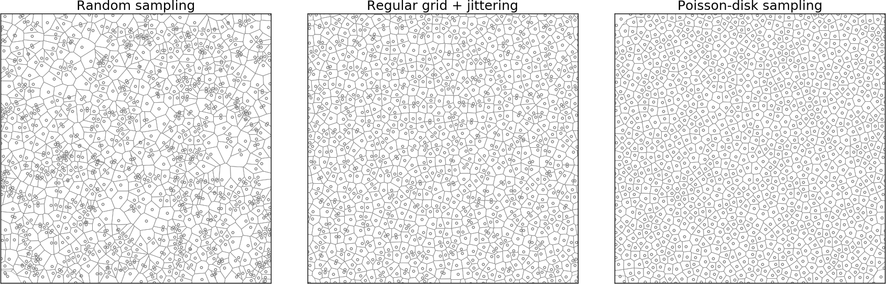

## Chapter 5 - Problem vectorization

* [Introduction](#introduction)
* [Scipy to the rescue](#scipy)
* [Uniform sampling](#poisson)
* [Finding the shortest path](#shortest)
* [Simulating smoke](#smoke)
* [Neural networks](#network)
* [Conclusion](#conclusion)

### Introduction 
### Scipy to the rescue 
### Uniform sampling 

**Code**

  * [sampling.py](../code/sampling.py)

**References**

* [Visualizing Algorithms]
  (https://bost.ocks.org/mike/algorithms/)  
  Mike Bostock, 2014.

* [Fast Poisson Disk Sampling in Arbitrary Dimensions]
  (http://www.cs.ubc.ca/~rbridson/docs/bridson-siggraph07-poissondisk.pdf)  
  Robert Bridson, SIGGRAPH, 2007.
  
* [Poisson Disk Sampling]
  (http://devmag.org.za/2009/05/03/poisson-disk-sampling/)  
  Herman Tulleken, 2009.

### Finding the shortest path 
### Simulating smoke 
### Neural Networks 
### Conclusion 
