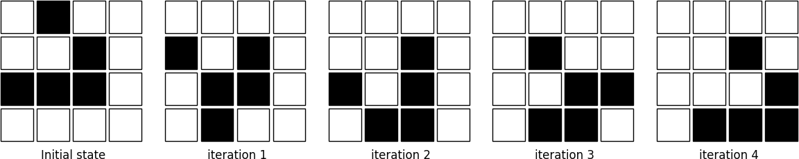

Code vectorization
===============================================================================

.. contents:: **Contents**
   :local:

Introduction
------------

Code vectorization means that the problem you're trying to solve is inherently
vectorizable and only requires a few numpy tricks to make it faster. Of course
it does not mean it is easy nor straighforward, but at least it does not
necessitate to totally rethink your problem (as it will be the case in the
`Problem vectorization`_ chapter). Still, it may require some experience to see
where code can be vectorized. Let's illustrate this through the most simple
example where we want to sum up two lists of integers. One simple way using
pure Python is:

.. code-block:: python

   def add_python(Z1,Z2):
       return [z1+z2 for (z1,z2) in zip(Z1,Z2)]

This first naive solution can be vectorized very easily using numpy:

.. code-block:: python

    def add_numpy(Z1,Z2):
        return np.add(Z1,Z2)
    
Without any surprise, benchmarking the two approaches shows the second method
is the fastest with one order of magnitude.

.. code-block:: pycon

   >>> Z1 = random.sample(range(1000), 100)
   >>> Z2 = random.sample(range(1000), 100)
   >>> timeit("add_python(Z1, Z2)", globals())
   1000 loops, best of 3: 68 usec per loop
   >>> timeit("add_numpy(Z1, Z2)", globals())
   10000 loops, best of 3: 1.14 usec per loop
    
Not only the second approach is faster, but it also naturally adapts to the
shape of `Z1` and `Z2`. This is the reason why we did not write `Z1 + Z2`
because it would not work if `Z1` and `Z2` were both lists. In the first Python
method, the inner `+` is interpreted differently depending on the nature of the
two objects such that if we consider two nested lists, we get the following
outputs:

.. code-block:: pycon

   >>> Z1 = [[1, 2], [3, 4]]
   >>> Z2 = [[5, 6], [7, 8]]
   >>> Z1 + Z2
   [[1, 2], [3, 4],[5, 6], [7, 8]]
   >>> add_python(Z1, Z2)
   [[1, 2, 5, 6], [3, 4, 7, 8]]
   >>> add_numpy(Z1, Z2)
   [[ 6  8]
    [10 12]]

The first method concatenates the two lists together, the second method
concatenates the internal lists together and the last one computes what is
(numerically) expected. As an exercise, you can rewrite the python version
such that it accepts nested lists of any depth.

      
Uniform vectorization
---------------------

Uniform vectorization is the simplest form of vectorization where all the
elements share the same computation at every time step with no specific
processing for any element. One stereotypical case is the Game of Life that has
been invented by John Conway (see below) and is one of the earliest example of
cellular automata. Those cellular automaton can be conveniently considered as
an array of cells that are connected together with the notion of neighbour and
their vectorization is straightforward. Let me first define the game and we'll
see how to vectorize it.

The Game of Life
++++++++++++++++

.. note::

   Excerpt from the Wikipedia entry on the 
   `Game of Life <https://en.wikipedia.org/wiki/Conway%27s_Game_of_Life>`_
   
The Game of Life is a cellular automaton devised by the British mathematician
John Horton Conway in 1970. It is the best-known example of a cellular
automaton. The "game" is actually a zero-player game, meaning that its
evolution is determined by its initial state, needing no input from human
players. One interacts with the Game of Life by creating an initial
configuration and observing how it evolves.

The universe of the Game of Life is an infinite two-dimensional orthogonal grid
of square cells, each of which is in one of two possible states, live or
dead. Every cell interacts with its eight neighbours, which are the cells that
are directly horizontally, vertically, or diagonally adjacent. At each step in
time, the following transitions occur:

1. Any live cell with fewer than two live neighbours dies, as if by needs
   caused by under population.
2. Any live cell with more than three live neighbours dies, as if by
   overcrowding.
3. Any live cell with two or three live neighbours lives, unchanged, to the
   next generation.
4. Any dead cell with exactly three live neighbours becomes a live cell.

The initial pattern constitutes the 'seed' of the system. The first generation
is created by applying the above rules simultaneously to every cell in the seed
– births and deaths happen simultaneously, and the discrete moment at which
this happens is sometimes called a tick. (In other words, each generation is a
pure function of the one before.) The rules continue to be applied repeatedly
to create further generations.

Python implementation
+++++++++++++++++++++

.. note::

   We could have used the more efficient python `array interface
   <http://docs.python.org/3/library/array.html>`_ but it is more convenient to
   use the familiar list object.
   
In pure Python, we can code the Game of Life using a list of lists representing
the board where cells are supposed to evolve. Such a board will be equipped with
border of 0 that allows to accelerate things a bit by avoiding to have specific
tests for borders when counting the number of neighbours.

.. code:: python

   Z = [[0,0,0,0,0,0],
        [0,0,0,1,0,0],
        [0,1,0,1,0,0],
        [0,0,1,1,0,0],
        [0,0,0,0,0,0],
        [0,0,0,0,0,0]]

Taking the border into account, counting neighbours is then straightforward:

.. code:: python

   def compute_neigbours(Z):
       shape = len(Z), len(Z[0])
       N  = [[0,]*(shape[0]) for i in range(shape[1])]
       for x in range(1,shape[0]-1):
           for y in range(1,shape[1]-1):
               N[x][y] = Z[x-1][y-1]+Z[x][y-1]+Z[x+1][y-1] \
                       + Z[x-1][y]            +Z[x+1][y]   \
                       + Z[x-1][y+1]+Z[x][y+1]+Z[x+1][y+1]
       return N

To iterate one step in time, we then simply count the number of neighbours for
each internal cell and we update the whole board according to the 4
aforementioned rules:

.. code:: python

   def iterate(Z):
       N = compute_neighbours(Z)
       for x in range(1,shape[0]-1):
           for y in range(1,shape[1]-1):
                if Z[x][y] == 1 and (N[x][y] < 2 or N[x][y] > 3):
                    Z[x][y] = 0
                elif Z[x][y] == 0 and N[x][y] == 3:
                    Z[x][y] = 1
       return Z

The figure below shows 4 iterations on a 4x4 area where the initial state is a
`glider <https://en.wikipedia.org/wiki/Glider_(Conway%27s_Life)>`_, a structure
discovered by Richard K. Guy in 1970.
       
.. admonition:: **Figure 1**
   :class: legend

   The glider pattern is known to replicate itself one step diagonally in 4
   iterations.
       

Numpy implementation
++++++++++++++++++++

Starting from the Python version, the vectorization of the Game of Life
requires two parts, one responsible for counting the neighbours and one
responsible for enforcing the rules. Neighbour counting is relatively easy if
we remember we took care of adding a null border around the arena. By
considering partial views of the arena we can actually access neighbours quite
intuitively as illustred below for the one-dimensional case:

.. code::
   :class: output

                  ┏━━━┳━━━┳━━━┓───┬───┐
           Z[:-2] ┃ 0 ┃ 1 ┃ 1 ┃ 1 │ 0 │ (left neighbours)
                  ┗━━━┻━━━┻━━━┛───┴───┘
                        ↓︎
              ┌───┏━━━┳━━━┳━━━┓───┐
      Z[1:-1] │ 0 ┃ 1 ┃ 1 ┃ 1 ┃ 0 │ (actual cells)
              └───┗━━━┻━━━┻━━━┛───┘
                        ↑ 
          ┌───┬───┏━━━┳━━━┳━━━┓
   Z[+2:] │ 0 │ 1 ┃ 1 ┃ 1 ┃ 0 ┃ (right neighbours)
          └───┴───┗━━━┻━━━┻━━━┛

Going to the two dimensional case requires just a bit of arithmetic to make
sure to consider all the eight neighbours.

.. code:: python

  N = np.zeros(Z.shape, dtype=int)
  N[1:-1,1:-1] += (Z[ :-2, :-2] + Z[ :-2,1:-1] + Z[ :-2,2:] +
                   Z[1:-1, :-2]                + Z[1:-1,2:] +
                   Z[2:  , :-2] + Z[2:  ,1:-1] + Z[2:  ,2:])

For the rule enforcement, we can write a first version using `argwhere
<http://docs.scipy.org/doc/numpy/reference/generated/numpy.argwhere.html>`_
method that will give us the indices where a given condition is True.

.. code:: python

   # Flatten arrays
   N_ = N.ravel()
   Z_ = Z.ravel()

   # Apply rules
   R1 = np.argwhere( (Z_==1) & (N_ < 2) )
   R2 = np.argwhere( (Z_==1) & (N_ > 3) )
   R3 = np.argwhere( (Z_==1) & ((N_==2) | (N_==3)) )
   R4 = np.argwhere( (Z_==0) & (N_==3) )

   # Set new values
   Z_[R1] = 0
   Z_[R2] = 0
   Z_[R3] = Z_[R3]
   Z_[R4] = 1

   # Make sure borders stay null
   Z[0,:] = Z[-1,:] = Z[:,0] = Z[:,-1] = 0

Even if this first version does not use nested loops, it is far from optimal
because of the use of the 4 `argwhere` calls that may be quite slow. We can
instead factorize the rules into cells that will survive (stay at 1) and cells
that will give birth. For doing this, we can take advantage of Numpy boolean
capability and write quite naturally:

.. note::

   We did no write `Z = 0` as this would simply assign the value 0 to `Z` that
   would then become a simple scalar.

.. code:: python

   birth = (N==3) & (Z[1:-1,1:-1]==0)
   survive = ((N==2) | (N==3)) & (Z[1:-1,1:-1]==1)
   Z[...] = 0
   Z[1:-1,1:-1][birth | survive] = 1

    
If you look at the `birth` and `survive` lines, you'll see that these two
variables are arrays that can be used to set `Z` values to 1 after having
cleared it.

.. admonition:: **Figure 2**
   :class: legend

   The Game of Life. Gray levels indicate how miuch a cell has been active in
   the past.

.. raw:: html

         <video width="100%" autoplay controls>
         <source src="../pics/game-of-life.mp4" type="video/mp4">
         Your browser does not support the video tag. </video>

Exercise
++++++++

Reaction and diffusion of chemical species can produce a variety of patterns,
reminiscent of those often seen in nature. The Gray Scott equations model such
a reaction. For more information on this chemical system see the article
*Complex Patterns in a Simple System* (John E. Pearson, Science, Volume 261,
1993). Let's consider two chemical species `U` and `V` with respective
concentrations `u` and `v` and diffusion rates `Du` and `Dv`. `V` is converted
into `P` with a rate of conversion `k`. `f` represents the rate of the process
that feeds `U` and drains `U`, `V` and `P`. This can be written as:

.. list-table::
   :widths: 50 50
   :header-rows: 1

   * - Chemical reaction
     - Equations

   * - :math:`U + 2V  \rightarrow 3V`
     - :math:`\dot{u} = Du \nabla^2 u - uv^2 + f(1-u)`
       
   * - :math:`V  \rightarrow P`
     - :math:`\dot{v} = Dv \nabla^2 v + uv^2 - (f+k)v`

Based on the Game of Life example, try to implement such reaction-diffusion system.
Here is a set of interesting parameters to test:

============= ===== ===== ===== =====
Name          Du    Dv    f     k 
============= ===== ===== ===== =====
Bacteria 1    0.16  0.08  0.035 0.065
------------- ----- ----- ----- -----
Bacteria 2    0.14  0.06  0.035 0.065
------------- ----- ----- ----- -----
Coral         0.16  0.08  0.060 0.062
------------- ----- ----- ----- -----
Fingerprint   0.19  0.05  0.060 0.062
------------- ----- ----- ----- -----
Spirals       0.10  0.10  0.018 0.050
------------- ----- ----- ----- -----
Spirals Dense 0.12  0.08  0.020 0.050
------------- ----- ----- ----- -----
Spirals Fast  0.10  0.16  0.020 0.050
------------- ----- ----- ----- -----
Unstable      0.16  0.08  0.020 0.055
------------- ----- ----- ----- -----
Worms 1       0.16  0.08  0.050 0.065
------------- ----- ----- ----- -----
Worms 2       0.16  0.08  0.054 0.063
------------- ----- ----- ----- -----
Zebrafish     0.16  0.08  0.035 0.060
============= ===== ===== ===== =====

The figure below show some animation of the model for a specific set of parameters.

.. admonition:: **Figure 3**
   :class: legend

   Reaction-diffusion Gray-Scott model. From left to right, *Bacteria 1*, *Coral* and
   *Spiral Dense*.

.. raw:: html

         <video width="33%" autoplay controls>
         <source src="../pics/gray-scott-1.mp4" type="video/mp4">
         Your browser does not support the video tag. </video>

         <video width="33%" autoplay controls>
         <source src="../pics/gray-scott-2.mp4" type="video/mp4">
         Your browser does not support the video tag. </video>
         
         <video width="33%" autoplay controls>
         <source src="../pics/gray-scott-3.mp4" type="video/mp4">
         Your browser does not support the video tag. </video>

Sources
+++++++

* `game-of-life-python.py <../code/game-of-life-python.py>`_
* `game-of-life-numpy.py <../code/game-of-life-numpy.py>`_
* `gray-scott.py <../code/gray-scott.py>`_ (solution to the exercise)

References
++++++++++

* `John Conway new solitaire game "life" <https://web.archive.org/web/20090603015231/http://ddi.cs.uni-potsdam.de/HyFISCH/Produzieren/lis_projekt/proj_gamelife/ConwayScientificAmerican.htm>`_, Martin Gardner, Scientific American 223, 1970.
* `Gray Scott Model of Reaction Diffusion <http://groups.csail.mit.edu/mac/projects/amorphous/GrayScott/>`_, Abelson, Adams, Coore, Hanson, Nagpal, Sussman, 1997.
* `Reaction-Diffusion by the Gray-Scott Model <http://mrob.com/pub/comp/xmorphia/>`_,
  Robert P. Munafo, 1996.

..   .. code::
..      :class: output
..
..      ┌───┬───┬───┬───┐  ┌───┬───┬───┬───┐  ┌───┬───┬───┬───┐  ┌───┬───┬───┬───┐  
..      │   │   │   │   │  │   │   │   │   │  │   │   │   │   │  │   │   │ # │   │
..      ├───┼───┼───┼───┤  ├───┼───┼───┼───┤  ├───┼───┼───┼───┤  ├───┼───┼───┼───┤
..      │   │ # │ # │   │  │   │ # │ # │   │  │   │ # │ # │ # │  │   │   │ # │ # │
..      ├───┼───┼───┼───┤  ├───┼───┼───┼───┤  ├───┼───┼───┼───┤  ├───┼───┼───┼───┤
..      │ # │   │ # │   │  │   │   │ # │ # │  │   │   │   │ # │  │   │ # │   │ # │
..      ├───┼───┼───┼───┤  ├───┼───┼───┼───┤  ├───┼───┼───┼───┤  ├───┼───┼───┼───┤
..      │   │   │ # │   │  │   │ # │   │   │  │   │   │ # │   │  │   │   │   │   │
..      └───┴───┴───┴───┘  └───┴───┴───┴───┘  └───┴───┴───┴───┘  └───┴───┴───┴───┘

Differential vectorization (temporal)
-------------------------------------

The Mandelbrot set is the set of complex numbers `c` for which the function
:math:`f_c(z) = z^2+ c` does not diverge when iterated from :math:`z=0`, i.e.,
for which the sequence :math:`f_c(0), f_c(f_c(0))`, etc., remains bounded in
absolute value. It is very easy to compute but it can take a very long time
because you need to ensure a given number does not diverge. This is generally
done by iterating the computation up to a maximum number of iterations, after
which, if the number is still within some bounds, it is considerered non
divergent. Of course, the more iteration you do, the more precision you get.

Python implementation
+++++++++++++++++++++

A pure python implementation is written as:

.. code-block:: python

   def mandelbrot_python(xmin, xmax, ymin, ymax, xn, yn, maxiter, horizon=2.0):
       def mandelbrot(z, maxiter):
           c = z
           for n in range(maxiter):
               if abs(z) > horizon:
                   return n
               z = z*z + c
           return maxiter
       r1 = [xmin+i*(xmax-xmin)/xn for i in range(xn)]
       r2 = [ymin+i*(ymax-ymin)/yn for i in range(yn)]
       return [mandelbrot(complex(r, i),maxiter) for r in r1 for i in r2]

The interesting (and slow) part of this code is the `mandelbrot` function that
actually computes the sequence :math:`f_c(f_c(f_c ...)))`. The vectorization of
such code is not totally straighforward because the internal `return` implies a
differential processing of the element. Once it has diverged, we don't need to
iterate any more and we can safely return the iteration count at
divergence. Problem is then to do the same numpy. But how ?

Numpy implementation
++++++++++++++++++++

The trick is to search at each iteration values that have not yet diverged and
update relevant information for these values and only these values. Because we
start from Z = 0, we know that each value will be updated at least once (when
they're equal to 0, they have not yet diverged) and will stop being updated as
soon as they've diverged. To do that, we'll use numpy fancy indexing with the
`less(x1,x2)` function that return the truth value of (x1 < x2) element-wise.

.. code-block:: python

   def mandelbrot_numpy(xmin, xmax, ymin, ymax, xn, yn, maxiter, horizon=2.0):
       X = np.linspace(xmin, xmax, xn, dtype=np.float32)
       Y = np.linspace(ymin, ymax, yn, dtype=np.float32)
       C = X + Y[:,None]*1j
       N = np.zeros(C.shape, dtype=int)
       Z = np.zeros(C.shape, np.complex64)
       for n in range(maxiter):
           I = np.less(abs(Z), horizon)
           N[I] = n
           Z[I] = Z[I]**2 + C[I]
       N[N == maxiter-1] = 0
       return Z, N

Here is the benchmark:

.. code-block:: pycon

   >>> xmin, xmax, xn = -2.25, +0.75, int(3000/3)
   >>> ymin, ymax, yn = -1.25, +1.25, int(2500/3)
   >>> maxiter = 200
   >>> timeit("mandelbrot_1(xmin, xmax, ymin, ymax, xn, yn, maxiter)", globals())
   1 loops, best of 3: 6.1 sec per loop
   >>> timeit("mandelbrot_2(xmin, xmax, ymin, ymax, xn, yn, maxiter)", globals())
   1 loops, best of 3: 1.15 sec per loop

Faster Numpy implementation
+++++++++++++++++++++++++++

There gain is roughly a 5x factor, not as much as we can have expected. Part of
the problem is that the `np.less` function implies `xn*yn` tests at every
iteration while we know that some values have already diverged. Even if these
tests are performed at the C level (through numpy), the cost is nonetheless non
negligible. Another approach proposed by `Dan Goodman
<https://thesamovar.wordpress.com/>`_ is to work on a dynamic array at each
iteration that stores only the points which have not yet diverged. It requires
more lines but the result is faster and lead to a 10x factor speed improvement
compared to the Python version.

.. code-block:: python

   def mandelbrot_numpy_2(xmin, xmax, ymin, ymax, xn, yn, itermax, horizon=2.0):
       Xi, Yi = np.mgrid[0:xn, 0:yn]
       Xi, Yi = Xi.astype(np.uint32), Yi.astype(np.uint32)
       X = np.linspace(xmin, xmax, xn, dtype=np.float32)[Xi]
       Y = np.linspace(ymin, ymax, yn, dtype=np.float32)[Yi]
       C = X + Y*1j
       N_ = np.zeros(C.shape, dtype=np.uint32)
       Z_ = np.zeros(C.shape, dtype=np.complex64)
       Xi.shape = Yi.shape = C.shape = xn*yn

       Z = np.zeros(C.shape, np.complex64)
       for i in range(itermax):
           if not len(Z): break

           # Compute for relevant points only
           np.multiply(Z, Z, Z)
           np.add(Z, C, Z)

           # Failed convergence
           I = abs(Z) > horizon
           N_[Xi[I], Yi[I]] = i+1
           Z_[Xi[I], Yi[I]] = Z[I]

           # Keep going with those who have not diverged yet
           np.negative(I,I)
           Z = Z[I]
           Xi, Yi = Xi[I], Yi[I]
           C = C[I]
       return Z_.T, N_.T

Benchmark gives us:

.. code-block:: pycon
                
   >>> timeit("mandelbrot_3(xmin, xmax, ymin, ymax, xn, yn, maxiter)", globals())
   1 loops, best of 3: 510 msec per loop

Visualization
+++++++++++++ 

Here is a picture of the result where we use recount normalization, power
normalized colormap (gamma=0.3) and shading. See `mandelbrot.py`.

.. admonition:: **Figure 4**
   :class: legend

   The Mandelbrot set using recount normalization, power
   normalized colormap (gamma=0.3) and light shading.

.. figure:: ../pics/mandelbrot.png
   :width: 100%

    

Exercise
++++++++

.. note::

   You should look at the `ufunc.reduceat <https://docs.scipy.org/doc/numpy/reference/generated/numpy.ufunc.reduceat.html>`_ method that performs a (local) reduce with specified slices over a single axis.

We now want to measure the fractal dimension of the Mandelbrot set using the
`Minkowski–Bouligand dimension
<https://en.wikipedia.org/wiki/Minkowski–Bouligand_dimension>`_. To do that we
need to do a box-counting with decreasing box size (see figure below). As you
imagine, we cannot use pure Python because it would be way to slow. The goal of
the exercise is to write a function using Numpy that takes a two-dimensional
float array and return the dimension. We'll consider values in the array to be
normalized (i.e. all values are between 0 and 1).

.. admonition:: **Figure 5**
   :class: legend

   The Minkowski–Bouligand dimension of the Great Britain coastlines is
   approximately 1.24.

.. figure:: ../pics/fractal-dimension.png
   :width: 100%

Sources
+++++++

* `mandelbrot.py <../code/mandelbrot.py>`_
* `mandelbrot-python.py <../code/mandelbrot-python.py>`_
* `mandelbrot-numpy-1.py <../code/mandelbrot-numpy-1.py>`_
* `mandelbrot-numpy-2.py <../code/mandelbrot-numpy-2.py>`_
* `fractal-dimension.py <../code/fractal-dimension.py>`_ (solution to the exercise)

References
++++++++++

* `How To Quickly Compute the Mandelbrot Set in Python <https://www.ibm.com/developerworks/community/blogs/jfp/entry/How_To_Compute_Mandelbrodt_Set_Quickly?lang=en>`_, Jean Francois Puget, 2015.
* `My Christmas Gift: Mandelbrot Set Computation In Python <https://www.ibm.com/developerworks/community/blogs/jfp/entry/My_Christmas_Gift?lang=en>`_, Jean Francois Puget, 2015.
* `Fast fractals with Python and Numpy <https://thesamovar.wordpress.com/2009/03/22/fast-fractals-with-python-and-numpy/>`_, Dan Goodman, 2009.
* `Renormalizing the Mandelbrot Escape <http://linas.org/art-gallery/escape/escape.html>`_, Linas Vepstas, 1997.

Differential vectorization (spatial)
------------------------------------

Boids
+++++

.. note::

   Excerpt from the Wikipedia entry 
   `Boids <https://en.wikipedia.org/wiki/Boids>`_

Boids is an artificial life program, developed by Craig Reynolds in 1986, which
simulates the flocking behaviour of birds. The name "boid" corresponds to a
shortened version of "bird-oid object", which refers to a bird-like object.

As with most artificial life simulations, Boids is an example of emergent
behavior; that is, the complexity of Boids arises from the interaction of
individual agents (the boids, in this case) adhering to a set of simple
rules. The rules applied in the simplest Boids world are as follows:

* **separation**: steer to avoid crowding local flockmates
* **alignment**: steer towards the average heading of local flockmates
* **cohesion**: steer to move toward the average position (center of mass) of
  local flockmates
  

.. admonition:: **Figure 6**
   :class: legend

   Boids are governed by a set of three local rules (separation, cohesion and
   alignment) that serve as computing velocity and acceleration.

.. image:: ../pics/boids.png
   :width: 100%

Python implementation
+++++++++++++++++++++

Numpy implementation
++++++++++++++++++++

Visualization
+++++++++++++

Sources
+++++++

* `boid-python.py <../code/boid-python.py>`_
* `boid-numpy.py <../code/boid-numpy.py>`_

References
++++++++++

* `Flocks, herds and schools: A distributed behavioral model <http://www.red3d.com/cwr/boids/>`_, Craig Reynolds, SIGGRAPH, 1987

  
Conclusion
----------
