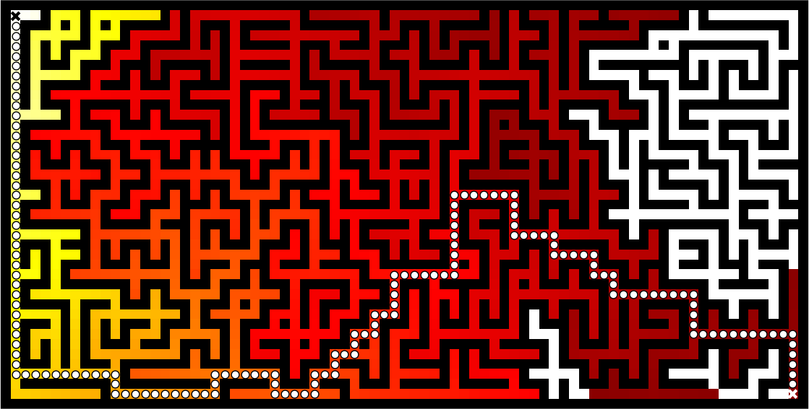

.. ----------------------------------------------------------------------------
.. Title:   From Python to Numpy
.. Author:  Nicolas P. Rougier
.. Date:    January 2017
.. License: Creative Commons Share-Alike Non-Commercial International 4.0
.. ----------------------------------------------------------------------------

Problem vectorization
===============================================================================

.. contents:: **Contents**
   :local:

Introduction
------------

Problem vectorization is much harder than code vectorization because it means
basically that you have to rethink your problem in order to make it
vectorizable. Most of the time this means you have to use a different algorithm
to solve tour problem or even worse... to invent a new one. The difficulty is thus
to think out of the box.

To illustrate this, let's consider a simple problem where given two vectors `X` and
`Y`, we want to compute the sum of `X[i]*Y[j]` for all pairs of indices `i`,
`j`. One simple and obvious solution is to write:

.. code:: python
          
   def compute_python(X, Y):
       result = 0
       for i in range(len(X)):
           for j in range(len(Y)):
               result += X[i] * Y[j]
       return result
    
However, this first and naive implementation requires two loops and we already
know it will be slow:

.. code:: pycon

   >>> X = np.arange(1000)
   >>> timeit("compute_python(X,X)")
   1 loops, best of 3: 0.274481 sec per loop

How to vectorize the problem then? If you remember your linear algebra course,
you may have identified the expression `X[i] * Y[j]` to be very similar to a
matrix product expression. So maybe we could benefit from some numpy
speedup. One wrong solution would be to write:

.. code:: python

   def compute_numpy_wrong(X, Y):
       return (X*Y).sum()
  
This is wrong because the `X*Y` expression will actually compute a new vector
`Z` such that `Z[i] = X[i] * Y[i]` and this is not what we want. Instead, we
can exploit numpy broadcasting by first reshaping the two vectors and then
multiply them:

.. code:: python
          
   def compute_numpy(X, Y):
       Z = X.reshape(len(X),1) * Y.reshape(1,len(Y))
       return Z.sum()
  
Here we have `Z[i,j] == X[i,0]*Y[0,j]` and if we take the sum over each elements of
`Z`, we get the expected result. Let's see how much speedup we gain in the
process:

.. code:: pycon
          
   >>> X = np.arange(1000)
   >>> timeit("compute_numpy(X,X)")
   10 loops, best of 3: 0.00157926 sec per loop
  
This is better, we gained a factor of ~150. But we can do much better.

If you look again and more closely at the pure Python version, you can see that
the inner loop is using `X[i]` that does not depend on the `j` index, meaning
it can be removed from the inner loop. Code can be rewritten as:

.. code:: python

   def compute_numpy_better_1(X, Y):
       result = 0
       for i in range(len(X)):
           Ysum = 0
           for j in range(len(Y)):
               Ysum += Y[j]
           result += X[i]*Ysum
       return result

But since the inner loop does not depend on the `i` index, we might as well
compute it only once:

.. code:: python
          
   def compute_numpy_better_2(X, Y):
       result = 0
       Ysum = 0
       for j in range(len(Y)):
           Ysum += Y[j]
       for i in range(len(X)):
           result += X[i]*Ysum
       return result

Not so bad, we have the inner loop, meaning with transform a O(n*n) complexity
into O(n) complexity. Using the same approach, we can now write:

.. code:: python
          
   def compute_numpy_better_3(x, y):
       Ysum = = 0
       for j in range(len(Y)):
           Ysum += Y[j]
       Xsum = = 0
       for i in range(len(X)):
           Xsum += X[i]
       return Xsum*Ysum

Finally, having realized we only need the product of the sum over `X` and `Y`
respectively, we can benefit from the `np.sum` function and write:

.. code:: python

   def compute_numpy_better(x, y):
       return np.sum(y) * np.sum(x)
    
It is shorter, clearear and much, much faster:

.. code:: pycon
          
   >>> X = np.arange(1000)
   >>> timeit("compute_numpy_better(X,X)")
   1000 loops, best of 3: 3.97208e-06 sec per loop

We have indeed reformulated our problem, taking advantage of the fact that
:math:`\sum_{ij}{X_i}{Y_j} = \sum_{i}X_i \sum_{j}Y_j$`
   
What we've learned from this simple example is that there is two kinds of
vectorization, the code vectorization and the problem vectorization. The latter
is the most difficult but the most important because this is where you can
expect huge gains in speed. In this simple example, we gain a factor 150 with
code vectorization but we gained a factor 70000 with problem vectorization,
just by writing our problem differently (even though you cannot expect such
huge speedup in all situation.). However, code vectorization remains an
important factor and if we rewrite the last solution the Python way, the gain
is good but not as much as in the Numpy version:

.. code:: python
          
   def compute_python_better(x, y):
       return sum(x)*sum(y)

This new Python version is much faster than the previous Python version, but
still, it is 50 times slower than the numpy version:

.. code:: pycon

   >>> X = np.arange(1000)
   >>> timeit("compute_python_better(X,X)")
   1000 loops, best of 3: 0.000155677 sec per loop
    

Path finding
------------

.. admonition:: **Figure 8**
   :class: legend

   Path finding using the Bellman-Ford algorithm. Gradient colors indicate
   propagated values from the end-point of the maze (bottom-right). Path is
   found by ascending gradient from the goal.

Breadth-first
+++++++++++++

Bellman-Ford method
+++++++++++++++++++

Sources
+++++++

References
++++++++++

           
Smoke simulation
----------------

Particle method
+++++++++++++++

Grid method
+++++++++++

Sources
+++++++

References
++++++++++

Poisson disk sampling
---------------------

DART method
+++++++++++

Numpy implementation
++++++++++++++++++++

.. admonition:: **Figure 9**
   :class: legend

   Comparison of uniform, grid-jittered and Poisson disc sampling.

.. image:: ../data/sampling.png
   :width: 100%

Sources
+++++++

* `sampling.py <../code/sampling.py>`_
* `mosaic.py <../code/mosaic.py>`_
* `voronoi.py <../code/voronoi.py>`_

References
++++++++++

* `Visualizing Algorithms <https://bost.ocks.org/mike/algorithms/>`_
  Mike Bostock, 2014.
* `Stippling and Blue Noise <http://www.joesfer.com/?p=108>`_
  Jose Esteve, 2012.
* `Poisson Disk Sampling <http://devmag.org.za/2009/05/03/poisson-disk-sampling/>`_
  Herman Tulleken, 2009.
* `Fast Poisson Disk Sampling in Arbitrary Dimensions <http://www.cs.ubc.ca/~rbridson/docs/bridson-siggraph07-poissondisk.pdf>`_
  Robert Bridson, SIGGRAPH, 2007.

Conclusion
----------
